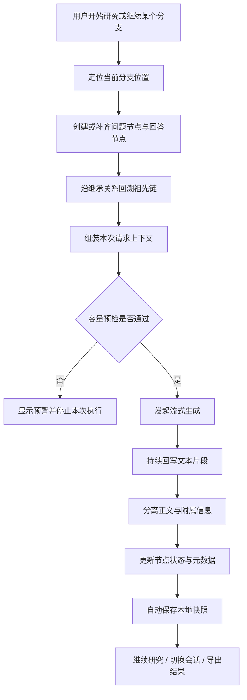
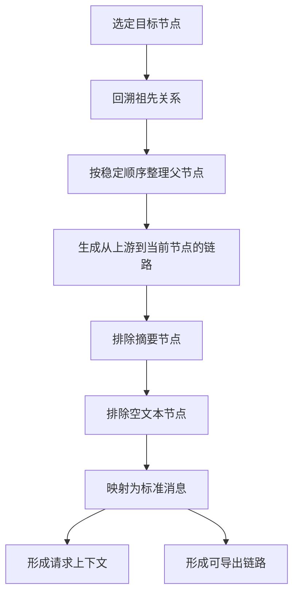
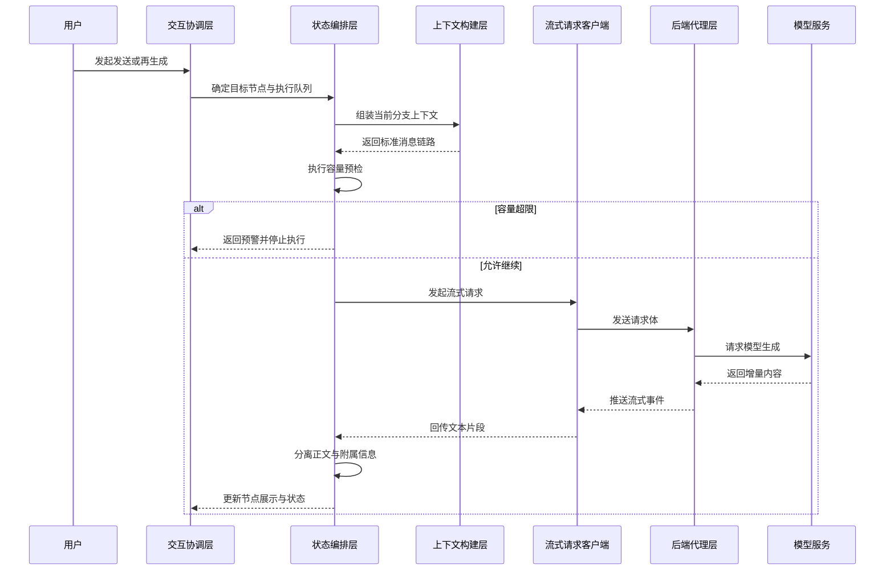
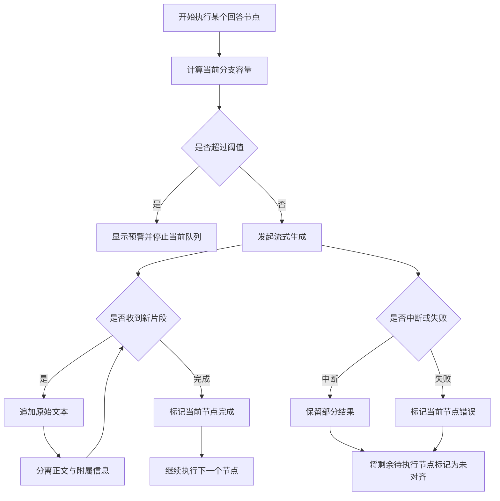
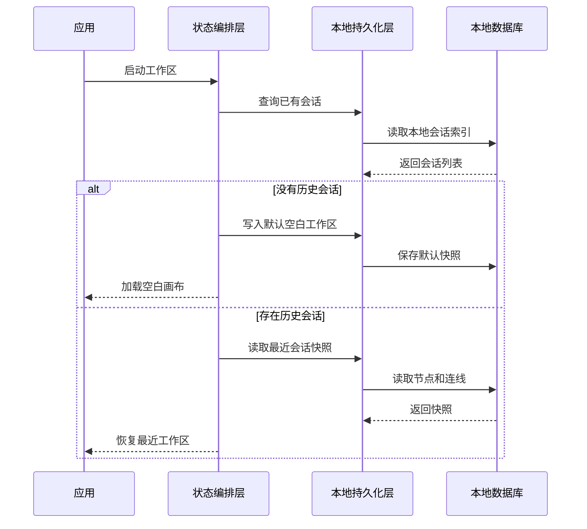
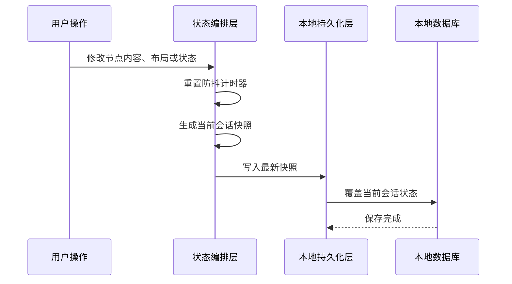

# 上下文管理机制

本文档描述 GitChat 当前已实现的研究/对话上下文管理机制，重点覆盖上下文如何形成、一次研究动作如何被执行、状态如何被保存与恢复，以及研究结果如何被导出。本文档只描述当前已经落地的机制，不使用源码中的文件名和内部函数名来组织叙述。

## 1. 背景与术语

GitChat 不是线性聊天记录工具。它把研究过程表达为一张有向无环图（DAG），让用户能够在同一张画布上分支、回溯、比较和沉淀不同路径上的研究结果。

文中使用以下术语：

- `Session`：一个独立研究画布。
- `Node`：画布上的节点，当前分为 `userInput`、`llmResponse`、`summaryNote`。
- `Edge`：节点之间的继承关系，决定上下文如何向下传递。
- 祖先链：从某个目标节点向上追溯到根节点的一条或多条前驱路径。
- 上下文链路：最终真正参与模型请求的消息序列。
- 生成队列：一组按顺序串行执行的生成任务。
- `stale`：节点保留了旧内容，但这些内容已经与上游状态不完全对齐。
- `toolPayload`：从模型流式输出中拆分出的附属信息，例如思考块或搜索块。

系统的核心原则只有一条：可视化连线决定上下文继承。用户在画布上看到的继承路径，应尽可能等价于发给模型的真实上下文路径。`summaryNote` 节点虽然属于研究过程的一部分，但不会进入模型请求上下文。

## 2. 整体闭环概览

一次完整的研究动作通常遵循以下闭环：

1. 用户选择一个已有分支继续推进，或从空白画布创建新的根问题。
2. 系统根据用户当前的选择位置，建立新的问题节点和对应的回答节点。
3. 在真正发起模型请求之前，系统沿着当前分支向上回溯，找出应参与本次推理的全部祖先内容。
4. 系统对即将发送的上下文进行容量预检，避免分支内容过长而继续盲目生成。
5. 如果预检通过，系统发起流式请求，并把增量内容持续回写到目标回答节点。
6. 在回写过程中，系统把正文与附属信息拆开存储，保证节点展示清晰。
7. 生成结束后，系统更新节点状态和元数据，并把最新研究快照保存到本地。
8. 用户可以继续在该分支上推进，也可以切换画布、恢复历史状态，或导出某条研究链路与整个项目。

从这个角度看，GitChat 的上下文管理不是单一算法，而是一套贯穿“分支创建、上下文形成、生成执行、状态降级、自动保存、导出恢复”的连续机制。



## 3. 上下文如何形成

### 3.1 图关系如何被整理

在执行上下文回溯之前，系统会先把当前画布中的节点和连线整理成便于查询的关系结构：

- 节点标识到节点内容的映射。
- 某个节点有哪些父节点的映射。
- 某个节点有哪些子节点的映射。

这样做的目的是让系统能够稳定回答三个问题：

- 某个节点的上游是谁。
- 某个节点的下游是谁。
- 从某个节点出发，怎样按稳定顺序回溯出完整祖先链。

当一个节点有多个父节点或多个子节点时，系统会按照创建时间顺序处理，尽量保持回溯和遍历结果稳定，避免同一画布在不同时间得到不同的上下文顺序。

### 3.2 祖先链如何回溯

当系统需要为某个目标节点准备上下文时，会从该节点开始向上递归访问所有父节点：

1. 如果节点不存在，停止。
2. 如果节点已经访问过，停止，避免重复遍历。
3. 先处理它的所有父节点。
4. 再把当前节点加入结果。

这样得到的结果天然是“从上游到当前节点”的顺序，而不是反向堆叠的顺序。这个顺序既适合发给模型，也适合导出阅读。

### 3.3 哪些节点会进入模型上下文

并不是所有出现在祖先链中的节点都会进入模型上下文。系统会进一步做两层筛选：

1. 摘要节点会被排除，因为它承担的是研究沉淀和人工备注角色，不承担模型记忆角色。
2. 空文本节点会被排除，因为它们对模型没有有效信息价值。

对于保留下来的节点，系统再把它们映射为标准消息：

- 用户输入节点映射为 `role: user`
- 模型回答节点映射为 `role: assistant`

最终形成按顺序排列的 `messages` 数组，作为本次模型请求的直接输入。

### 3.4 为什么导出与请求使用同一条链路

系统把“发给模型的上下文”和“导出的研究链路”建立在同一条祖先回溯逻辑上。这样做有两个好处：

- 用户看到并导出的链路，与模型真正参考过的链路高度一致。
- 文档导出不需要另造一套规则，避免出现“系统实际推理依据”和“用户导出的研究记录”彼此偏离。

因此，链路导出本质上不是额外功能，而是对当前上下文链路的另一种呈现方式。

### 3.5 伪代码：上下文组装

```text
function ASSEMBLE_CONTEXT_CHAIN(targetNode, graph):
  relationMap = BUILD_RELATION_MAP(graph)
  orderedNodes = []
  visited = set()

  function VISIT(node):
    if node is missing:
      return
    if node.id in visited:
      return

    visited.add(node.id)
    parentNodes = SORT_PARENTS_BY_CREATION_TIME(node, relationMap)

    for each parentNode in parentNodes:
      VISIT(parentNode)

    orderedNodes.append(node)

  VISIT(targetNode)

  messages = []
  for each node in orderedNodes:
    if node is summary node:
      continue
    if node text is empty:
      continue

    role = USER if node is input node else ASSISTANT
    messages.append({
      role: role,
      content: node text
    })

  return messages
```



## 4. 生成如何被调度和中断

### 4.1 研究动作生命周期

当前系统支持四类常见研究动作：

1. 从空白画布创建根问题。
2. 在某个已有回答下继续创建分支。
3. 针对某个已有问题重新生成它后续的回答路径。
4. 在生成过程中主动中断，保留已得到的部分结果并给后续节点打降级标记。

无论入口是什么，系统最终都要完成三件事：

- 确定本次生成作用在哪个回答节点上。
- 确定发给模型的上下文链路是什么。
- 确定在成功、失败、中断、阻断四种结果下如何更新节点状态。

### 4.2 发送前如何建立目标节点

当用户从输入区发起新问题时，系统会根据当前选中的位置来决定它挂在哪个分支下：

- 如果当前选中了某个回答节点，就在这个回答节点下继续分支。
- 如果没有显式选择，就回退到最近的回答节点继续延展。
- 如果画布还没有回答节点，就把这次输入作为根问题起点。

随后系统会建立一对新的节点：

- 一个新的用户输入节点。
- 一个承接该输入的回答节点。

如果这是在已有分支下继续推进，系统还会把新问题节点接到来源回答节点之下。这样，继续分支和创建根问题虽然入口不同，但都会转化为“问题节点 + 回答节点”的统一结构。

### 4.3 为什么需要生成队列

一个问题节点在重新生成时，可能带动多个后续回答节点一起更新。如果这些更新全部并发执行，会出现三类问题：

- 上下文依赖顺序混乱。
- 中断时很难判断哪些节点已经有效更新、哪些节点应该保留旧结果。
- 本地状态与界面反馈难以保持一致。

因此，当前实现采用串行生成队列。系统会把一批待执行回答节点排成顺序列表，逐个执行，并在每一步都维护当前活动节点、剩余队列和全局运行状态。

### 4.4 单次生成如何执行

每次执行某个回答节点的生成时，系统会按如下顺序工作：

1. 先找到它对应的上游问题节点。
2. 基于该问题节点所在分支计算当前上下文容量。
3. 如果容量达到预警阈值，则阻断本次生成，并提示用户应先总结、再分支。
4. 如果容量允许，则清空目标回答节点已有输出，准备接受新内容。
5. 组装请求上下文，并读取该问题节点携带的模型和开关配置。
6. 发起流式请求。
7. 每接收到一段流式文本，就追加到原始输出中。
8. 在追加之后，系统立刻尝试把正文和附属信息拆开保存。
9. 请求完成后，把回答节点状态更新为完成，并记录累计的上下文信息。

如果用户主动中断，请求会立即终止，当前节点保留已经收到的部分内容。如果请求报错，当前节点进入错误状态。

### 4.5 正文与附属信息如何拆分

模型返回的流式内容不一定全部属于最终正文。当前系统允许模型输出带标记的附属内容，例如思考过程或搜索摘要。

因此，系统在每次回写片段时都会做一次内容分离：

- 原始文本持续累计，作为完整回放依据。
- 附属块从原始文本中被识别并拆出。
- 主正文保留为适合直接展示和阅读的文本。
- 附属块单独存入 `toolPayload`，供界面折叠展示。

这样做的目的不是改变模型输出，而是把同一次回答中的“最终表达”和“生成过程附带信息”分层存储。

### 4.6 中断、失败、阻断时如何降级

生成流程的结果分为四类：

- 成功：当前回答节点完成更新，队列继续前进。
- 主动中断：当前回答节点保留部分结果，后续待执行节点被标记为未对齐。
- 请求失败：当前回答节点进入错误状态，后续待执行节点被标记为未对齐。
- 容量阻断：当前回答节点不执行，队列停止。

这里最关键的是“未对齐”语义。它不是说节点内容丢失，而是说节点当前保留的是旧版本结果，读者需要知道这些结果并没有基于最新的上游内容重新计算。

### 4.7 伪代码：完整生成闭环

```text
function EXECUTE_RESEARCH_ACTION(entryPoint, userInput, graphState):
  targetBranch = RESOLVE_BRANCH_POSITION(entryPoint, graphState)
  targetPair = ENSURE_INPUT_AND_RESPONSE_NODES(targetBranch, userInput, graphState)
  executionQueue = COLLECT_RESPONSE_TARGETS(targetPair, graphState)

  MARK_SYSTEM_AS_RUNNING(executionQueue)

  for each responseTarget in executionQueue:
    contextMessages = ASSEMBLE_CONTEXT_CHAIN(parent input of responseTarget, graphState)
    capacityResult = CHECK_CONTEXT_CAPACITY(contextMessages)

    if capacityResult is blocked:
      SHOW_WARNING()
      STOP_QUEUE()
      break

    PREPARE_RESPONSE_TARGET(responseTarget)
    requestConfig = READ_NODE_LEVEL_CONFIGURATION(parent input of responseTarget)

    streamResult = START_STREAMING_REQUEST(contextMessages, requestConfig)

    while streamResult has next chunk:
      APPEND_RAW_OUTPUT(responseTarget, chunk)
      SPLIT_MAIN_TEXT_AND_AUXILIARY_BLOCKS(responseTarget)
      UPDATE_RENDER_STATE(responseTarget)

    if streamResult is interrupted:
      KEEP_PARTIAL_OUTPUT(responseTarget)
      MARK_REMAINING_QUEUE_AS_STALE()
      break

    if streamResult is failed:
      MARK_RESPONSE_AS_ERROR(responseTarget)
      MARK_REMAINING_QUEUE_AS_STALE()
      break

    MARK_RESPONSE_AS_DONE(responseTarget)

  MARK_SYSTEM_AS_IDLE()
  SCHEDULE_PERSISTENCE()
```





## 5. 状态如何保存、恢复与迁移

### 5.1 为什么保存机制属于上下文管理的一部分

上下文管理并不只发生在请求发出那一刻。对于长时间研究来说，系统必须保证以下三件事：

- 当前研究图谱不会因为刷新页面而丢失。
- 不同画布之间的上下文不会互相污染。
- 某条研究链路和整个项目都可以被独立迁移或导出。

因此，本地持久化、会话恢复和导入导出并不是附属功能，而是上下文资产管理的一部分。

### 5.2 自动保存如何触发

系统在工作区加载完成之后，会持续监听研究状态的变化。只要图谱发生改变，例如：

- 节点文本发生变化。
- 节点尺寸发生变化。
- 节点位置发生变化。
- 节点生成状态发生变化。
- 会话内容发生变化。

系统就会启动一次防抖保存。只有当一小段时间内不再继续变化时，当前会话的完整快照才会写入本地。

当前保存策略采用“会话级快照覆盖”，而不是增量日志。也就是说，每次保存都会把当前会话的节点、连线和会话元数据作为一整块状态写回本地。

### 5.3 启动恢复与会话切换

当应用启动时，系统会先检查本地是否已有会话：

- 如果没有，就创建一个默认工作区。
- 如果有，就恢复最近更新的那个会话。

恢复完成后，系统把对应的节点和连线重新加载到当前画布，并把工作区标记为已就绪。

当用户切换到其他会话时，系统会重新读取目标会话的快照，并用它替换当前画布状态。这样不同研究画布虽然共存于同一浏览器环境中，但彼此上下文边界是隔离的。

### 5.4 项目导入导出

系统支持两种导出粒度：

- 链路级导出：导出某个节点向上回溯得到的一条研究链路。
- 项目级导出：导出全部会话、节点和连线，作为完整研究资产备份。

项目级导出的意义在于，它允许用户把本地研究状态整体迁移到新的环境中。导入时，系统会读取导出文件中的完整快照，并用它替换当前本地存储内容。

### 5.5 为什么摘要节点只参与保存，不参与推理

摘要节点属于研究资产的一部分，所以它们会被保存、恢复、导出，也会在项目级迁移时保留。

但它们不会进入模型请求上下文，因为它们的作用是：

- 固定研究结论。
- 记录人工判断。
- 保存阶段性观察。

它们服务于研究组织，而不是服务于模型记忆。

### 5.6 伪代码：自动保存

```text
on RESEARCH_STATE_CHANGED:
  if workspace is not ready:
    return
  if there is no active session:
    return

  RESET_DEBOUNCE_TIMER()

  after short delay:
    snapshot = BUILD_CURRENT_SESSION_SNAPSHOT()
    WRITE_SNAPSHOT_TO_LOCAL_STORAGE_LAYER(snapshot)
```

### 5.7 伪代码：启动恢复

```text
function RESTORE_WORKSPACE_ON_STARTUP():
  availableSessions = READ_AVAILABLE_SESSIONS()

  if availableSessions is empty:
    defaultSession = CREATE_DEFAULT_WORKSPACE()
    WRITE_EMPTY_SNAPSHOT(defaultSession)
    ACTIVATE_SESSION(defaultSession)
    MARK_WORKSPACE_READY()
    return

  latestSession = PICK_MOST_RECENT_SESSION(availableSessions)
  snapshot = READ_SESSION_SNAPSHOT(latestSession)
  LOAD_GRAPH_FROM_SNAPSHOT(snapshot)
  ACTIVATE_SESSION(latestSession)
  MARK_WORKSPACE_READY()
```





## 6. 外部接口与领域数据

本节只保留理解机制所必需的外部接口和领域结构，不描述内部实现符号。

### 6.1 节点级请求配置

问题节点可以携带一组请求配置，并在执行时透传到后端。这些配置当前包括：

- `model`
- `enableWebSearch`
- `enableThinking`
- `systemPromptOverride`

这些字段决定同一张研究图中不同分支可以使用不同模型、不同能力开关和不同系统提示策略。

### 6.2 节点级状态元数据

节点在运行过程中会维护一组状态元数据，当前主要包括：

- `accumulatedTokens`
- `isStale`
- `errorMessage`
- `tokenWarning`

这些字段用于表达：当前分支累计上下文规模、节点是否未对齐、是否发生错误，以及是否触发容量预警。

### 6.3 附属信息结构

当系统从流式结果中分离出思考块或搜索块时，会把它们作为 `toolPayload` 保存。每一项通常包含：

- `type`
- `title`
- `content`

它们属于回答节点的一部分，但与主正文分层展示。

### 6.4 请求与返回格式

模型请求的核心结构是：

```json
{
  "messages": [
    { "role": "user", "content": "..." }
  ],
  "config": {
    "model": "...",
    "enableWebSearch": false,
    "enableThinking": false,
    "systemPromptOverride": ""
  }
}
```

后端以流式事件返回增量内容。典型事件包括：

- 普通文本片段
- 结束标记
- 错误标记

这意味着当前系统的回答节点不是一次性生成完成，而是在接收到增量事件时逐步成长。

## 7. 当前限制与实现偏差

以下内容是当前机制的实际边界，不应被误读为未来目标：

- 当前容量估算采用启发式近似，不是官方 tokenizer 的精确计算结果。
- 当前附属信息分离依赖文本标记约定，不是原生工具调用协议。
- 在容量阻断场景下，队列会停止，但剩余待执行节点当前不会自动被标记为未对齐。
- 项目级导入目前以整体替换本地状态为主，尚未提供更严格的版本校验、结构校验和二次确认。
- 当前本地保存采用会话级快照覆盖，不是细粒度增量同步。
- 摘要节点会被完整保存和导出，但不会参与模型推理上下文。

## 8. 系统能力总结

GitChat 当前的上下文管理机制可以概括为三条能力主线：

1. 把画布中的可视继承路径稳定地转换为可执行的模型上下文链路。
2. 把发送、再生成、中断、失败和未对齐降级统一到一套连续的生成流程中。
3. 把本地保存、会话恢复、链路导出和项目迁移纳入同一套研究资产管理闭环中。

因此，这个系统管理的并不只是聊天记录，而是整条研究路径上的上下文资产：它如何被建立、如何被执行、如何在异常时保留、以及如何在未来继续被复用。
